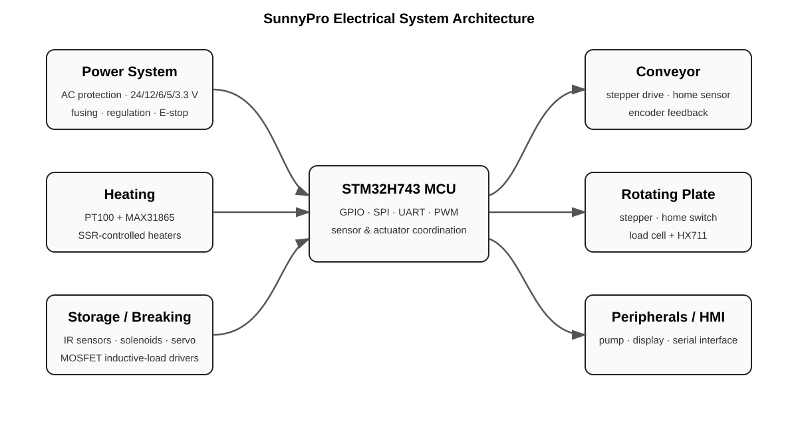

# SunnyPro - Electrical Architecture & Schematic Design

**STM32H743 · KiCad · hierarchical schematics · sensing · heating · motion control · protected multi-rail power**

Electrical architecture and complete KiCad schematic design for an automated food-service machine. I was responsible for the **electrical architecture and every electrical schematic published in this repository**, including MCU I/O planning, power distribution, temperature measurement, heater control, motor/encoder interfaces, load-cell measurement, actuator drivers, component selection, power calculations and BOM development.

| | |
|---|---|
| **Controller** | STM32H743 |
| **Architecture** | 8-sheet hierarchical KiCad design |
| **Power rails** | 24 V · 12 V · 6 V · 5 V · 3.3 V |
| **Sensing** | PT100/MAX31865 · HX711 load cell · IR sensors · home switches |
| **Actuation** | SSR heaters · TB6600/NEMA17 · ULN2003A/28BYJ-48 · MOSFET solenoids/pumps · servo |
| **My scope** | electrical architecture · all schematics · I/O planning · component selection · power calculations · BOM |
| **Academic context** | HSRW Group Project · Summer Semester 2026 |



### Quick links

- [Full schematic PDF](exports/SunnyPro-schematics.pdf)
- [KiCad source](hardware/)
- [Design summary](docs/design-summary.md)
- [Ownership statement](SOURCE_OWNERSHIP.md)

> **Ownership boundary:** SunnyPro was a university group project. The electrical architecture and all electrical schematics shown in this repository were my individual responsibility. This repository does not claim authorship of mechanical, software or other team work.

## Electrical Design Responsibility

I developed the architecture from subsystem requirements and created the complete hierarchical schematic set myself. My work included:

- Complete hierarchical electrical architecture
- All electrical schematics in the repository
- MCU I/O planning and signal allocation
- Power-demand calculations and rail planning
- Component selection
- Protection and safety design
- Sensor and actuator interface design
- Heating-control electronics
- Motor/encoder interfaces
- Load-cell measurement interface
- Bill of materials development
- Organization of the system into maintainable subsystem sheets

No part of the SunnyPro electrical schematic set presented here was supplied as a pre-designed course schematic.

## Design Scope

The electrical system is organized into hierarchical KiCad sheets covering:

- MCU and signal interfaces
- AC input protection and DC power distribution
- Bottom and top heating systems
- Conveyor transportation
- Storage and egg-breaking actuators
- Rotating plate and load-cell measurement
- Oil-pump and HMI/peripheral interfaces

## Temperature Measurement and Heater Control

The temperature-measurement and heater-control electronics integrate **PT100 RTDs with MAX31865 interfaces** for temperature acquisition and connect them to the STM32 control system.

The heating circuits combine:

- **PT100 / MAX31865 temperature measurement**
- **SSR-controlled mains heaters**
- Fusing and thermal protection
- Low-voltage MCU control interfacing

This required coordinating low-voltage sensor electronics with higher-power loads and protection circuitry.

## Power Architecture

The system power distribution uses a protected mains input and several derived DC rails:

- **24 V** main DC rail
- **12 V, 6 V and 5 V** regulated rails
- **3.3 V** logic rail
- RCCB, MCB, individual fuses and emergency-stop protection

The work included power-demand calculations, rail allocation, protection choices and component selection.

## Motion, Sensors and Actuators

The design integrates several sensing and actuation technologies:

- NEMA17 stepper motor with **TB6600** driver
- Step/direction/enable control and encoder feedback
- 28BYJ-48 stepper with **ULN2003A** driver
- **Load cell + HX711** measurement interface
- IR sensors and home switches
- Solenoid and pump channels using MOSFET drivers with flyback protection
- Servo actuation
- Serial HMI interface

## MCU Integration

The **STM32H743** is the central interface between sensing, motion, heating and HMI subsystems. I planned the MCU signal allocation and subsystem interfaces across the complete electrical schematic set.

## Project Files

```text
hardware/
├── SunnyPro.kicad_pro
├── SunnyPro.kicad_sch
├── SunnyPro.kicad_sym
├── MCU.kicad_sch
├── POWER.kicad_sch
├── CONVEYOR_TRANSPORTATION_SUBSYSTEM.kicad_sch
├── EGG_BREAKING_STORAGE.kicad_sch
├── BOTTOM_HEATING_SUBSYSTEM.kicad_sch
├── TOP_IR_HEATING_SUBSYSTEM.kicad_sch
├── ROTATING_PLATE.kicad_sch
└── PERIPHERALS.kicad_sch

exports/
└── SunnyPro-schematics.pdf

docs/
└── design-summary.md

images/
└── architecture.svg
```

Every electrical schematic listed above was designed by me. In the sanitized public source, the KiCad schematic title blocks identify **Ahmed Yehia** as the author, while private identifiers are omitted.

The portfolio scope of this repository is **electrical architecture and schematic design**; no SunnyPro PCB-layout authorship is claimed here.

Per-user KiCad state files (`*.kicad_prl`), autosaves, backup/cache files and operating-system metadata are excluded because they are not part of the electrical design and can contain local-machine state.

## Tools and Skills

`KiCad` · `STM32H743` · `Hierarchical Schematic Design` · `PT100 / MAX31865` · `Temperature Measurement` · `Power Distribution` · `Sensors` · `Motor Drivers` · `MOSFET Drivers` · `SSRs` · `Load Cells` · `Embedded Hardware Interfaces` · `Component Selection` · `Power Calculations` · `BOM Development`
